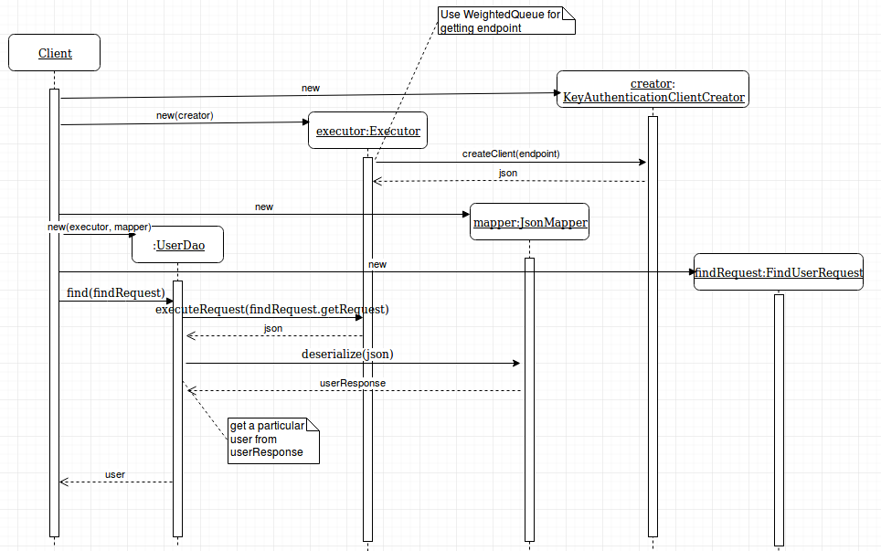

# cs-entities
Simple CloudStack Entities Framework

The aim of the library is the convenient interaction with Apache CloudStack entities. It provides the following mechanisms to:
1. Retrieve some entities from Apache CloudStack server
2. Create entity in Apache CloudStack server from some predefined set

## Install with SBT

Add the following to your `build.sbt`
```scala
TODO: "libraryDependencies += "
```
## Getting Started      

The diagram below is a simple illustration of how the library's classes should be used. \


Implement your GenericDao, Request, and Response hierarchy for working with another entities \

## Example Usage

The example below shows how to create new user entity in CloudStack server and then retrieve it:
```scala

```
## Testing

### Unit tests

Run tests: `sbt test`

### Integration tests

## Versioning

Library has the same version as Apache CloudStack server

## License

This project is licensed under the Apache License - see the [LICENSE](LICENSE) file for details
  